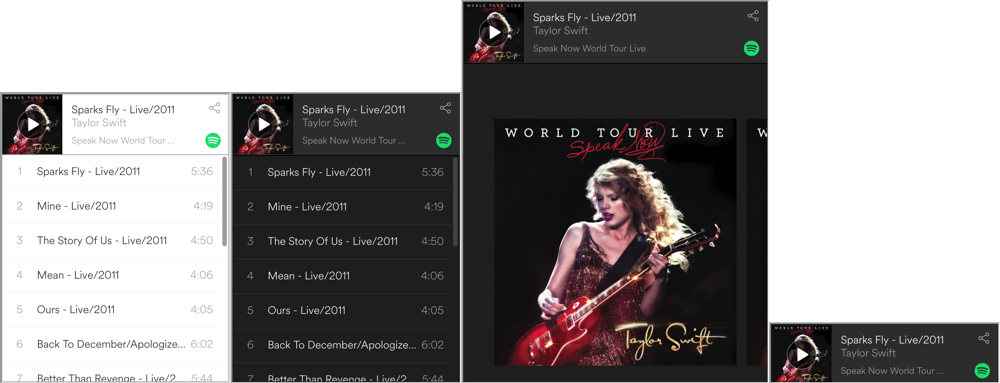

# react-spotify-widgets

React components for Spotify widgets

Installation: 

```sh
npm install react-spotify-widgets
```

Props for play widget: `width`, `height`, `uri`, `lightTheme`, `showCoverArt`

Example:
```js
import React, { Component } from 'react';
import PlayWidget from 'react-spotify-widgets';

class App extends Component {
  render() {
    return (
      <div className='App'>
        <PlayWidget
          width={300}
          height={380}
          uri={'spotify:album:6fyR4wBPwLHKcRtxgd4sGh'}
          lightTheme={true}
        />
        <PlayWidget
          width={300}
          height={380}
          uri={'spotify:album:6fyR4wBPwLHKcRtxgd4sGh'}
        />
        <PlayWidget
          width={400}
          height={500}
          uri={'spotify:album:6fyR4wBPwLHKcRtxgd4sGh'}
          viewCoverArt={true}
        />
        <PlayWidget
          width={300}
          height={80}
          uri={'spotify:album:6fyR4wBPwLHKcRtxgd4sGh'}/>
      </div>
    );
  }
}
```

